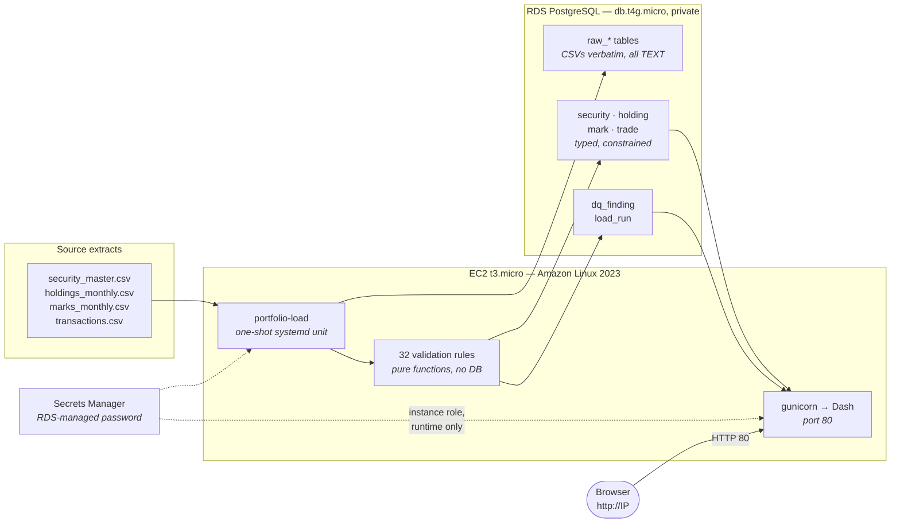

# Fixed-income portfolio analytics

Loads four CSV extracts for a ~$850M bond portfolio into PostgreSQL, validates them
against 32 rules, computes portfolio analytics, and serves the result as a Plotly Dash
dashboard.

The extracts contain deliberate defects. Finding and handling them is a substantial
part of the work, so the data-quality layer is treated as a first-class feature rather
than a preprocessing step: every anomaly is detected by a rule, recorded with its
before-and-after values, and surfaced in the application.

---

## Architecture



**Why this shape.**

*Three storage layers.* `raw_*` tables hold the delivered CSVs verbatim — every column
`TEXT`, nothing constrained — so a malformed value can never fail the insert. The
curated tables are typed and constrained. `dq_finding` records every anomaly. This is
what makes each repair auditable: the data-quality page shows the original value beside
the correction, and a reviewer can verify one without re-reading a CSV. It also means
the data-quality page cannot drift out of agreement with the rules, because it is a
projection of them.

*Rules are pure functions.* The validation layer has no database dependency at all, so
it is testable without infrastructure and the loader only orchestrates. That is why the
test suite runs anywhere with no server and no credentials.

*The database is not publicly accessible.* The app reaches it over private VPC
networking. The password lives in Secrets Manager and is read at runtime through the
EC2 instance role, so it is absent from this repository, from disk on the instance, and
from user-data — which matters, because any process on the instance can read user-data
from the metadata service.

*No SSH.* Port 22 is never opened. Shell access, log tailing and redeploys all go
through SSM Session Manager, authenticated by IAM rather than a key file.

---

## Quick start (local)

Requires Python 3.11+. No database server needed — SQLite is enough to run everything
locally, and the schema uses dialect variants so the same definitions work on both.

```bash
python3.11 -m venv .venv && .venv/bin/pip install -e ".[dev,serve]"
```

```bash
cp .env.example .env && sed -i '' 's|^DATABASE_URL=.*|DATABASE_URL=sqlite:///local.db|' .env
```

```bash
.venv/bin/portfolio-load && .venv/bin/portfolio-serve
```

Then open <http://127.0.0.1:8050>. Run the tests with `.venv/bin/python -m pytest`.

Against local PostgreSQL instead, set
`DATABASE_URL=postgresql+psycopg://postgres@localhost:5432/portfolio`.

---

## Deployment (AWS)

Two scripts, in order. Both are idempotent and both have a `teardown`.

```bash
./deploy/rds.sh provision
```

```bash
./deploy/ec2.sh provision
```

`rds.sh` creates a `db.t4g.micro` with 20GB gp3, **not** publicly accessible, with
`--manage-master-user-password` so AWS generates the password into Secrets Manager and
no human ever sees it. `ec2.sh` then creates the instance role (scoped to that one
secret ARN), opens port 80 only, launches the instance, loads the data and starts the
app. The public URL comes from `./deploy/ec2.sh url`.

**IAM.** The deploy scripts need EC2, RDS and Secrets Manager access, plus a small set
of IAM permissions for the instance role. Rather than `IAMFullAccess`, attach the scoped
policy in [`deploy/iam-policy.json`](deploy/iam-policy.json):

```bash
aws iam put-user-policy --user-name YOUR_USER --policy-name fixed-income-deploy --policy-document file://deploy/iam-policy.json
```

**Cost.** Roughly **$22/month** total (RDS ~$14.40, EC2 t3.micro ~$7.50). This account
is past the 12-month window, so none of it is free tier. `./deploy/ec2.sh teardown` and
`./deploy/rds.sh teardown` remove everything.

**Operating it**, without opening a port:

```bash
./deploy/ec2.sh logs
```

```bash
./deploy/ec2.sh redeploy
```

---

## How the data load works

```
read_csvs()          every column as a string
      ↓
raw_* tables         verbatim, with load_id and source_row_num
      ↓
clean_extract()      master → marks → holdings → transactions
      ↓
curated tables       typed and constrained
dq_finding           one row per anomaly
```

**Everything is read as a string.** Letting pandas infer types at read time would coerce
malformed values to `NaN` before any rule could see them, so a planted defect would
vanish on the way in and never reach the data-quality page. Typing happens in the
cleaning layer, where a parse failure becomes a finding instead.

**Rule order is a dependency order,** not a preference: the master first, because
everything else needs its id set to detect orphans; marks before holdings, because
holdings impute missing market values from price.

**The data load is one transaction.** A half-loaded warehouse is worse than an empty
one — the dashboard would serve numbers that look plausible and are wrong. The
`load_run` header commits separately, so a failure still leaves an auditable record of
the attempt, and the app only ever reads from the latest `SUCCEEDED` load.

**Re-running is a full refresh, not an append.** The extracts are a complete
twelve-month snapshot rather than an incremental feed, so the loader must be idempotent.

**Repairs are conservative by policy.** A value is only rewritten when the correct one
is recoverable from the data itself — a decimal-scale slip, a sign flip contradicted by
book value and adjacent months, a market value derivable from par × price. Anything
requiring a market judgement is flagged and left alone, because a confidently wrong
"correction" does more damage than a visible gap.

### The rules

32 rules across the four files: `SM001–006` (master), `MK001–007` (marks), `HL001–010`
(holdings), `TX001–009` (transactions). Every bound lives in
[`thresholds.py`](src/portfolio/load/thresholds.py) and **no rule references a security
id, a date, or a value from this particular extract** — that is what makes the
data-quality page work on a different extract. The test fixtures are dated 2031 with
invented ids, so a rule that accidentally hardcodes something fails the suite.

---

## Answers

### Q1 — Market value by month-end, and the largest move

| Month | Market value | Change | | Month | Market value | Change |
|---|---|---|---|---|---|---|
| Jan | $841.3M | — | | Jul | $834.5M | +$5.4M |
| Feb | $839.0M | −$2.4M | | Aug | $837.1M | +$2.6M |
| Mar | $824.9M | −$14.1M | | Sep | $825.5M | −$11.5M |
| Apr | $833.3M | +$8.4M | | Oct | $876.8M | **+$51.3M** |
| May | $833.4M | +$0.1M | | Nov | $880.8M | +$4.0M |
| Jun | $829.1M | −$4.3M | | Dec | $879.4M | −$1.4M |

**Largest absolute change: October 2025, +$51.25M**, of which:

| Component | Amount |
|---|---|
| Trading | **+$52.07M** |
| Price (market) | −$0.83M |
| Interaction | +$0.02M |

October was a buying month — eight trades, four new positions — with market moves a
slight drag.

**Decomposition method.** A position's market value is `par × price / 100`. Both factors
move between month-ends, so the change expands into three exact terms:

```
price effect  = par₍t-1₎ × (P₍t₎ − P₍t-1₎) / 100      market move on the opening position
trading       = (par₍t₎ − par₍t-1₎) × P₍t-1₎ / 100     trades at the opening price
interaction   = (par₍t₎ − par₍t-1₎) × (P₍t₎ − P₍t-1₎) / 100

ΔMV = price + trading + interaction        exactly, no residual
```

The interaction term is reported separately rather than folded into either side. It is
real — a bond bought during a month in which prices moved is attributable to neither
factor alone — and absorbing it silently is a common reason attribution fails to
reconcile. **Verified: the maximum residual across all twelve months is $0.000000.**

Trading is then measured a *second, independent* way — signed par × trade price from
`transactions.csv` — and the two are reconciled rather than assumed to agree. Residual
gaps are at most $0.66M (September) and are the expected consequence of month-end prices
versus actual trade prices. **This check earned its keep immediately**: it flagged a
$4.44M discrepancy in October that turned out to be a phantom position (see Q5, HL009).

### Q2 — January versus December allocation

**Sector — the three largest shifts, all driven by trading:**

| Sector | Weight | Value change | Market | Trading | Driver |
|---|---|---|---|---|---|
| Treasury | 9.1% → 12.1% (+2.99pp) | +$29.8M | +$0.9M | +$28.9M | **trading** |
| Financials | 19.1% → 21.4% (+2.27pp) | +$27.3M | −$0.2M | +$27.5M | **trading** |
| Consumer | 9.6% → 7.9% (−1.69pp) | −$11.2M | +$0.6M | −$11.8M | **trading** |

**Rating — the three largest shifts:**

| Rating | Weight | Value change | Market | Trading | Driver |
|---|---|---|---|---|---|
| A | 34.2% → 32.7% (−1.55pp) | −$0.6M | −$4.8M | +$4.1M | **market** |
| AA | 17.3% → 18.2% (+0.86pp) | +$14.1M | −$0.3M | +$14.4M | trading |
| AAA | 14.2% → 14.9% (+0.68pp) | +$11.4M | −$0.3M | +$11.8M | trading |

The A-rated row is the one that matters methodologically. The portfolio **bought** $4.1M
of A-rated paper and its weight still *fell*, because $4.8M of market losses more than
offset the buying. **A weight change is not a value change** — a sector or rating can
lose weight while gaining value simply because the rest of the portfolio grew faster —
so both are reported and the value change is decomposed with the same identity as Q1.
Reading weight movement alone would have produced the opposite conclusion here.

### Q3 — Energy, March 2025

| | |
|---|---|
| Average clean price | 99.8 → 91.8 (**−7.95%**) |
| Weighted-average OAS | 133 → 260bp (**+127bp**) |
| Sector market-value change | **−$12.44M** (price −$6.93M, trading −$6.09M) |
| Portfolio market-value change | −$14.09M |
| **Energy's share of the portfolio move** | **88.3%** |
| Securities affected | 8 of 8 |

Price down with spread sharply wider, across **every** name in the sector, is a credit
event rather than a rates move — a rates move would widen little and would hit
Treasuries too (Treasury OAS was flat at 4.5bp all year). It does not recover: Energy's
average price is still ~93 in December against ~99.8 in January, and its OAS stays above
300bp for the rest of the year.

Sector prices are equal-weighted while OAS is market-value weighted. An equal-weighted
price answers "what happened to bonds in this sector" without being dominated by one
large holding; OAS is a spread on capital at risk, so market value reflects real
exposure.

### Q4 — Worst full-year price returns among securities held all year

| # | Security | Sector | Price return | Price-only MV impact |
|---|---|---|---|---|
| 1 | Talon Petroleum 3.251% 07/26/2028 | Energy | −9.79% | −$2,196,611 |
| 2 | Basin Creek Energy 4.283% 11/16/2042 | Energy | −8.80% | −$768,652 |
| 3 | Card Funding Trust 4.048% 02/02/2036 | ABS | −8.71% | −$1,088,630 |
| 4 | Windward Midstream 6.470% 11/04/2031 | Energy | −7.70% | −$261,617 |
| 5 | Basin Creek Energy 4.765% 07/14/2043 | Energy | −6.84% | −$1,147,092 |
| 6 | Windward Midstream 4.532% 08/22/2036 | Energy | −6.82% | −$1,201,950 |
| 7 | Talon Petroleum 3.073% 06/02/2026 | Energy | −6.14% | −$497,825 |
| 8 | Granite Ridge Utilities 5.177% 01/19/… | Utilities | −5.12% | −$1,176,767 |
| 9 | Bluepeak Aerospace 4.131% 06/26/2032 | Industrials | −4.63% | −$373,561 |
| 10 | Talon Petroleum 3.986% 02/01/2035 | Energy | −4.06% | −$292,307 |
| | | | | **−$9.01M total** |

**Seven of the ten are Energy**, consistent with Q3.

The dollar impact is the sum of each month's price effect — `par₍t-1₎ × ΔP₍t₎ / 100` —
accumulated over the year, which isolates price from trading while respecting the par
actually held in each month. A naive "January par × full-year price change" would
overstate any position that was reduced mid-year: a holding halved in June did not
suffer the second half of the year's move at full size. Using the same identity as Q1
also means these per-security impacts sum back into the portfolio's total price effect.

### Q5 — Data quality

**71 findings from 11 rules** on this extract: 18 errors, 18 warnings, 35 informational.
All of it is visible on the app's Data quality page, which reads `dq_finding` and holds
no hardcoded content.

| Rule | Anomaly | How detected | How handled | n |
|---|---|---|---|---|
| **HL001** | Duplicate `(security_id, as_of_date)` holdings snapshots | Duplicate key on the documented grain | **Kept the row whose implied price reconciles to the independent mark**, not the latest `database_date` — see below | 8 |
| **MK002** | Prices quoted as a fraction of par (`0.9750`) instead of per 100 | Price below a plausibility floor, where ×100 lands back inside the band | Repaired ×100. Left alone it understates the position ~99% | 3 |
| **HL009** | A security reported **after it matured** | `as_of_date` later than `maturity_date` with non-zero par | Flagged `post_maturity`, retained for audit, **excluded from all aggregates** | 3 |
| **HL002** | Negative par with a *positive* book value | Sign disagreement, corroborated by positive par in other months | Repaired via absolute value | 1 |
| **TX003** | Trades on securities absent from the master | Referential check against the master id set | Excluded; notional disclosed | 2 |
| **TX001** | Duplicate `trade_id`, byte-identical | Duplicate id with identical business columns | Deduplicated as a double-send | 1 |
| **HL004** | Null `market_value` | Null check | Imputed as `par × price / 100` | 15 |
| **SM002/003** | Missing `sector` / `rating` | Null check on the master | Defaulted to visible placeholders (`Unclassified`, `NR`) | 3 |
| **HL010** | Held positions with no mark for the month | Left join against marks | Flagged; price falls back to the MV-implied value | 25 |
| **MK007** | Large month-over-month price moves | Move beyond a calibrated threshold | Flagged at INFO only, **never repaired** | 10 |

**Two findings worth expanding on, because both changed an answer.**

*HL001 — the obvious tie-break was wrong.* The natural rule is "latest `database_date`
wins", reading the later row as a restatement. The data contradicts it: for **all eight**
duplicated pairs, the *earlier* row's implied price reconciles to `marks_monthly` to four
decimal places (deviation exactly 0.0000) while the later row drifts by ~1.14 points. The
later "restatement" is the corrupted one, so "latest wins" would have kept the bad value
in every portfolio total. The rule therefore breaks ties by **cross-file reconciliation
against an independent source**, falling back to `database_date` only when no mark exists
to arbitrate. Confirmation: with this rule, the separate internal-consistency check
(HL006, market value versus par × price) drops to **zero** findings — two rules
corroborating rather than one flagging the other's mistake.

*HL009 — a phantom position worth $13.5M.* `XWRWGY7W4` (Fairfield Brands 6.475%
09/15/2025) matures on 2025-09-15, redeems correctly via a `MATURITY` trade for its full
15,200,000 par, and is correctly absent from the September snapshot. It then **reappears**
in October, November and December with 4,500,000 par and a market value frozen at exactly
4,494,150 each month, with no marks after August. A redeemed bond cannot carry market
value, so that is **$13,482,450 of fabricated value** across three months, inflating
October — the largest month of the year, and therefore the answer to Q1 — by $4.49M.
Excluding it dropped the October trading reconciliation gap from **$4.44M to −$0.05M**.

Note this was *found by the analytics*, not only by a rule: the two independent
measurements of trading disagreed, and chasing the difference located the defect.

**Rules that did not fire** on this extract but exist and are tested: duplicate master
ids, maturity before issue, unparseable dates, implausible coupons, duplicate marks,
out-of-band prices and OAS, marks on unknown securities, non-month-end snapshot dates,
`database_date` before `as_of_date`, conflicting duplicate `trade_id`, settlement before
trade, unknown trade types, non-positive trade par, out-of-band trade prices, maturities
not redeeming at par, and maturity dates disagreeing with the master.

### Bonus — Weighted-average coupon and OAS

| Month | Coupon (par-wtd) | OAS (MV-wtd) | | Month | Coupon | OAS |
|---|---|---|---|---|---|---|
| Jan | 4.53% | 136bp | | Jul | 4.56% | 145bp |
| Feb | 4.53% | 137bp | | Aug | 4.56% | 146bp |
| Mar | 4.59% | 150bp | | Sep | 4.53% | 149bp |
| Apr | 4.56% | 140bp | | Oct | 4.51% | 143bp |
| May | 4.55% | 150bp | | Nov | 4.50% | 132bp |
| Jun | 4.55% | 144bp | | Dec | 4.50% | 141bp |

**Weighting basis, and why.**

*Coupon on **par**.* Coupon is contractually paid on par, so annual income is exactly
`Σ(par × coupon)`. Par weighting is the only basis under which the weighted average
multiplied by total par reproduces the portfolio's actual income. Market-value weighting
overstates premium bonds and produces a number describing no real cash flow.

*OAS on **market value**.* OAS is a spread earned on capital at risk; market value
reflects the portfolio's true exposure and is the market convention for aggregating
spreads. Par weighting would treat a deeply discounted position as though full par were
exposed.

Both alternative bases are computed and available. On this extract they differ by
**0.01pp on coupon and under 1bp on OAS**, so the answer is robust to the convention
either way — which is a better thing to be able to say than to have simply picked
correctly. Coverage is reported per month: OAS coverage dips to 93.7% in March where
marks are missing, and an average over 93.7% of the portfolio is a different claim from
one over 100%.

---

## Assumptions log

Every judgement call, with its reasoning. The brief asks for these to be stated; a
well-reasoned assumption you disagree with should be easy to locate and argue with.

### Data handling

1. **Duplicate holdings snapshots are resolved by reconciliation to marks, not by load
   order.** Justified empirically above (HL001). If you believe `database_date` should
   win regardless, `Thresholds.mv_price_tolerance_pts` controls when reconciliation is
   considered to have succeeded; setting it to 0 forces the `database_date` fallback.
2. **Post-maturity positions are excluded from all aggregates**, retained in the table
   flagged `post_maturity`. A redeemed bond cannot carry market value. This is the single
   most consequential assumption in the project — it changes Q1's headline by $4.49M.
   `load_positions(include_post_maturity=True)` reverses it.
3. **Missing market values are imputed as `par × price / 100`** where a mark exists.
   Dropping them would understate portfolio market value and manufacture fake
   month-over-month swings; January would read $773.9M rather than $841.3M.
4. **Prices below 5.0 are treated as par-fraction scale errors** and multiplied by 100,
   but only when the result lands inside the plausible band. A genuinely distressed price
   of 25 is left alone.
5. **A negative par with a positive book value is a sign error**, not a short position,
   when the same security holds positive par in other months. A true short would carry a
   negative book value too. Where that corroboration is absent, the row is flagged rather
   than altered.
6. **Securities missing a sector or rating are defaulted to visible placeholders**
   (`Unclassified`, `NR`) rather than dropped or inferred. The position is real and must
   still count toward portfolio totals; rating is instrument-level, so inferring it from
   the issuer's other bonds is unsafe.
7. **Trades on securities absent from the master are excluded.** They cannot be
   attributed to a sector or rating, and including them would distort the allocation
   views. This removes real cash flow, so the notional is disclosed on the data-quality
   page. Two trades, $5.5M par combined.
8. **A duplicate `trade_id` with identical details is a double-send** and is
   deduplicated; one with *conflicting* details is an identifier collision and both rows
   are kept. Dropping one of the latter would lose a real cash flow.

### Analytics

9. **Where a security has no mark, price is implied from the reported market value.**
   Without this fallback 25 observations drop out of price attribution and the
   decomposition stops reconciling to the market-value change. It is mildly circular —
   inferring a price from a number derived *from* a price — and it means those
   observations can never show a price effect. Flagged as `price_source = "implied"` and
   ringed on the drill-down chart. **This is the assumption I am least confident in.**
10. **Trades are assigned to the month of `trade_date`, not `settlement_date`**, so
    activity lines up with the month-end snapshot it moved.
11. **The interaction term is reported separately**, and grouped with price into a
    "market" effect only for the driver verdict, on the grounds that the cross term
    exists only because prices moved.
12. **Sector price averages are equal-weighted; OAS is market-value weighted.**
    Reasoning in Q3.
13. **Coupon is par-weighted, OAS market-value weighted.** Reasoning in the bonus.
14. **Sector-months with fewer than two securities are excluded from the Q3 ranking.**
    A one-bond "sector average" is that bond's own price move and would compete with real
    sectors on idiosyncratic noise. The placeholder `Unclassified` bucket holds exactly
    one bond. Those rows remain in the detail table; only the ranking excludes them.
    Energy wins by a wide margin either way.
15. **Q4 "held for the entire year"** means non-zero par at all twelve month-ends.

### Architecture

16. **The raw layer is retained even though the CSVs are in the repo**, so every repair
    is auditable in the database itself and the data-quality page cannot drift from the
    rules.
17. **Money is `NUMERIC`, never float.** Binary floating point cannot represent 0.01, and
    summing 800 market values into a portfolio total is where that starts to show.
18. **`trade` carries a surrogate key rather than using `trade_id`**, because the rules
    deliberately retain conflicting duplicates (assumption 8).
19. **Re-loading is a full refresh.** The extracts are a complete snapshot, not an
    incremental feed.
20. **The app reads only from the latest `SUCCEEDED` load**, so a failed load cannot
    serve partial data.

### Known limitations

21. **No CI.** The 132 tests run locally and nothing verifies them on push. This is a gap
    worth closing.
22. **Dark mode is implemented and tested but has no UI toggle.** Templates and tokens
    exist for both modes; there is no control to switch.
23. **Verified against SQLite and PostgreSQL, but the RDS path is exercised only at
    deployment.** The schema uses dialect variants so the same definitions run on both.
24. **`dash_table` is deprecated** in favour of `dash-ag-grid`. It works; swapping it was
    not judged worth the churn.
25. **Single instance, no autoscaling, no TLS.** The brief explicitly permits plain HTTP
    and a bare IP. Production would want a certificate and a load balancer.

---

## Repository layout

```
src/portfolio/
├── config.py            environment-only configuration; Secrets Manager resolution
├── db.py                engine construction, schema creation, healthcheck
├── models.py            three-layer schema (raw / curated / data quality)
├── load/
│   ├── findings.py      the Finding model: rule, severity, action, before/after
│   ├── thresholds.py    every bound, externalised so no rule hardcodes one
│   ├── validate.py      the 32 rules — pure functions, no database
│   ├── pipeline.py      runs them in dependency order
│   └── loader.py        CSV → raw → curated, in one transaction
├── analytics/
│   ├── queries.py       the only place analytics touches SQL
│   ├── attribution.py   the price/trading/interaction identity (Q1, Q4)
│   ├── allocation.py    mix over time and shift attribution (Q2, Q3)
│   └── metrics.py       weighted averages, drill-down series (bonus)
└── app/
    ├── theme.py         validated palette and Plotly templates
    ├── figures.py       chart builders
    ├── components.py    stat tiles, tables, table-view twins
    ├── data.py          cached, database-only access
    ├── main.py          routing, /healthz, WSGI entry point
    └── pages/           overview · allocation · security · quality

deploy/
├── rds.sh               provision / status / env / teardown
├── ec2.sh               provision / status / url / logs / redeploy / teardown
└── iam-policy.json      scoped alternative to IAMFullAccess

tests/                   132 tests, no server or credentials required
```

## Testing

```bash
.venv/bin/python -m pytest
```

132 tests, no database server and no credentials needed. The cleaning rules are the most
heavily covered area, since they carry the most judgement.

Two properties are defended deliberately. **Clean input must produce zero findings** — a
rule that cries wolf makes the data-quality page useless. And **expected values are
hand-computed in the docstrings** rather than recorded from what the code produces, so
the tests survive a reimplementation. Writing them out that way caught two errors in my
own arithmetic where I had reached for an equal-weighted mean while the code correctly
used a market-value weighted one.

Fixtures are synthetic, dated **2031** with invented security ids, so any rule that
accidentally hardcodes a real id or the 2025 calendar fails the suite rather than passing
quietly. That is the assignment's "hand your app a different extract" requirement,
asserted rather than asserted-about.
